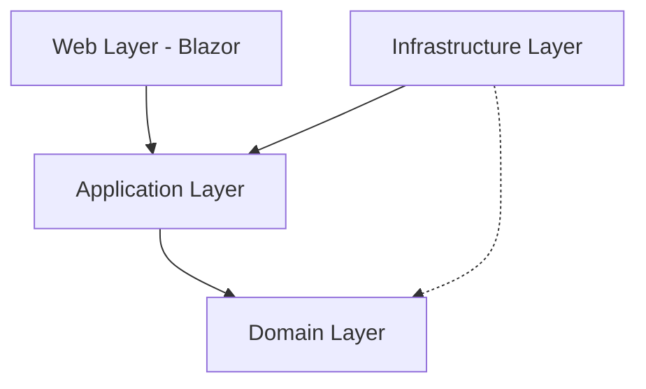

# Architecture Documentation - GajaTrack

GajaTrack follows **Clean Architecture** and **Domain-Driven Design (DDD)** principles to ensure maintainability, testability, and data integrity.

## System Overview

The application is structured into four main layers, with dependencies always pointing inward toward the Domain layer.

## Layers

### 1. Domain Layer (`src/GajaTrack.Domain`)
The core of the application. It contains business logic, entities, and value objects. It has zero dependencies on other layers or external libraries (except for core language features).

- **Entities:** `SleepSession`, `NursingFeed`, `BottleFeed`, `CryingSession`, `DiaperChange`.
- **Value Objects:** 
    - `UtcDateTime`: Ensures all dates are stored and manipulated as UTC.
    - `TimeRange`: Handles duration and intersection logic between two points in time.
- **Domain Services:**
    - `ProtocolDomainService`: Encapsulates business rules for the 24-hour protocol visualization, such as local-to-UTC window calculation and event clipping.

### 2. Application Layer (`src/GajaTrack.Application`)
Contains application-specific business rules and orchestrates the flow of data.

- **Interfaces:** Defines repository and service contracts (e.g., `ITrackingRepository`, `IProtocolService`).
- **Services:** Implements orchestration logic (e.g., `ProtocolService`, `BabyPlusImportService`).
- **DTOs:** Data transfer objects for external communication (e.g., `ProtocolDay`, `ExportDtos`).

### 3. Infrastructure Layer (`src/GajaTrack.Infrastructure`)
Handles technical concerns and communication with external systems.

- **Persistence:** EF Core implementation using SQLite (`GajaDbContext`).
- **Repositories:** Implements the domain repository interfaces.
- **Migrations:** Database schema versioning.
- **External Services:** Implementations of import/export logic.

### 4. Web Layer (`src/GajaTrack.Web` & `src/GajaTrack.Web.Client`)
The presentation layer built with .NET 9 Blazor, operating in a Client-Server model.

- **Server (`GajaTrack.Web`):**
    - Hosts the Blazor Server and serves the WASM client.
    - Exposes a **REST API** (`/api/protocol`, `/api/import`, etc.) for data access.
    - Registers direct service implementations (`Infrastructure` -> `Application`).
- **Client (`GajaTrack.Web.Client`):**
    - Runs in the browser (WebAssembly).
    - Contains all UI Pages and Components (`Home`, `ProtocolPage`, etc.).
    - Uses `HttpClient` implementations of Application interfaces to communicate with the Server API.

## Data Integrity Principles

1. **Strict UTC:** All time-based data is converted to UTC at the boundary (Value Object enforcement).
2. **UUIDv7:** Used for all entity identifiers to ensure sortability and uniqueness across distributed imports.
3. **Immutability:** Value objects are immutable record structs to prevent accidental state changes.

## Feature: 24-Hour Protocol

The protocol visualization uses a logical day window from **06:00 to 06:00 (Local Time)**. 
- The **Domain Service** calculates these windows in UTC.
- The **Application Service** fetches relevant events.
- The **Web Layer** renders events relative to the window start.
